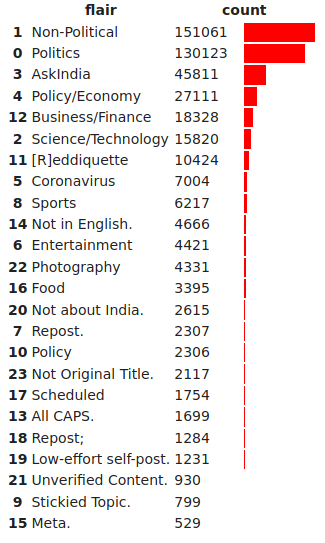
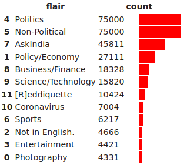
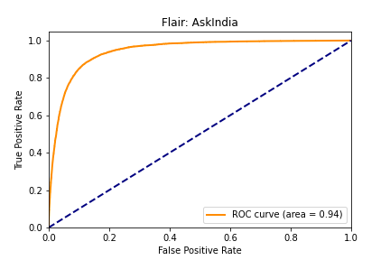
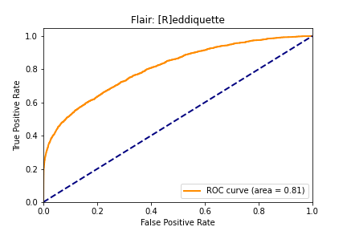
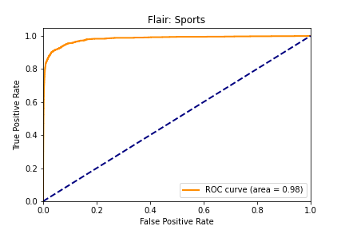

# RedditFlairDetector
This project aims at identifying the Flair (Reddit terminology for _category_) of a given Submission (_post_) the r/India Subreddit.

## Tasks Undertaken:
<details><summary><b>1. Data Acquisition</b></summary>
  <p>
    Collected Data using <a href = "https://github.com/pushshift/api">pushshift.io</a> and PRAW. Obtained a total of .7M data points across majorly 24 flairs. <br>
    <a href = "https://github.com/RachitBansal/RedditFlairDetector/blob/master/1_DataCollection.ipynb">Data Collection </a> <br>
    <a href = "https://github.com/RachitBansal/RedditFlairDetector/blob/master/2_EDA%26PreProcessing.ipynb">EDA and Pre-Processing </a>
  </p>
</details>
    
<details><summary><b>2. Data Modelling</b></summary>
  <p>
    Trained and Tested a wide range of models ranging from LogisticRegression to DistilBERT. <br>
    <a href = "https://github.com/RachitBansal/RedditFlairDetector/blob/master/3_Modelling_ML.ipynb">Machine Learning Models </a> <br>
    <a href = "https://github.com/RachitBansal/RedditFlairDetector/blob/master/3_Modelling_DL.ipynb">Deep Learning Models </a>
  </p>
</details>

<details><summary><b>3. Deploying on the Web</b></summary>
  <p>
    Designed the UI using HTML and CSS <br>
    Integrated with Flask and deployed on Heroku <br>
    <a href = "https://rflairdetection.heroku.com">The Website is LIVE</a>
  </p>
</details>

## Data Acquisition
### PRAW v/s PUSHSHIFT
PRAW, which makes use of the official Reddit API to scrape submissions from subreddits, has a limit of 250 data points per flair during data collection. For fair and accurate classifcation, a lot more data was required and that's what pushed me to use pushshift.io

A sample pushshift URL which returns ```size``` number of posts when called:

```
https://api.pushshift.io/reddit/search/submission/?subreddit={subreddit}&fields={fields}&size={size}&sort={sort}&after={after}&before={before}
```

Pushshift imposes an upper limit of 1000 posts per API call but I used the ```before``` and ```after``` parameters which are used to extract submissions between particular timestamps in the past. I toggled these parameters to obtain submissions ranging from over 5 years.

Different Dataset were gathered using PRAW and pushshift, comparisons have been drawn between the two throughout this dicumentation. 

 PRAW            | pushshift           |
 ---             | ---                 |
 250 data points per flair               | __No Limit on the amount of data to be extracted__              |
 __Comments Extracted__            | Comments could not be extracted                   |
 Limited Number of Flairs (~10 originally)              | __A wide variety of Flairs (~700 originally)__                    |
 __Equal Distribution of Data among different Flairs__               | Skewed distribution of data among different Flairs           |

### About the Data
The following features were extracted:

| Feature Name       | Type            | Description                           | PRAW            | pushshift           |
| ---                | ---             | ---                                   | ---             | ---                 |
| ID                 | STR             | ID of the post                        | Y               | Y                   |
| link_flair_text    | STR             | flair of the post                     | Y               | Y                   |
| num_comments       | INT             | number of comments on the post        | Y               | Y                   |
| selftext           | STR             | description of the post               | Y               | Y                   |
| title              | STR             | title of the post                     | Y               | Y                   |
| url                | STR             | URL associated with the post          | N                | Y                   |
| __comments__           | __LIST__            | __list of top comments__        | __Y__               | __N__                  |
| created_utc        | INT             | timestamp of post                     | N                | Y                   |

Shape of PRAW Data: ```(2925, 5)``` <br>
Shape of pushshift Data: ```(697000, 8)```

#### Pre-processing
There were 740 different kinds flairs in the data extracted using pushshift, the following preprocessing steps were applied:
- It was noted that there was a presence of redundant flairs which depict the same entity but are present as seperate labels. For example, two classes ```Business/Finance``` and ```Busines &amp Finance``` were present. Such flairs were converted into the same label. 
- There were a variety of flairs containing only a few data points corresponding to them, all such rows belonging to flairs with net data < 500 were removed. 
- Certain exceptions in the data had NULL values for either the ```title``` or the ```link_flair_text```, which are the main input and output values in our data respectively. Such exceptions were also removed. 

After these pre-processing steps, the pushshift data was reduced to ```24 flairs across a total of 446283 (~.45M) rows```.

The following figure depicts the data distribution across the flairs: 



An additional step to balance out the data between different flairs was introduced later so as to reduce the bias of the models towards the more prevelant classes. This was done by downsampling the classes with more prominence, which are ```Political``` and ```Non-Political``` in this case. And removing the data corresponding to flairs with less than 4k samples. The distribution across the falirs post this step is as below: 



## Data Modelling

The results of different models on the test set:

| Model | Features        |   Unbalanced Data Acc.  | Balanced-out Data Acc. |    
| ---   | ---                  | ---   |          ---           |
|     |         |         |               |
| Logistic Regression | Title + SelfText + URL <br> Title + URL <br> Title | 61.7 <br> 63.8 <br> 58.4 | 63.0 <br> 62.5 <br> 59.5 |
| MultinomialNB  | Title + SelfText + URL <br> Title + URL <br> Title | 51.8 <br> 52.0 <br> 52.1 | 51.8 <br> 52.0 <br> 52.1 |
| SVM Classifier  | Title + SelfText + URL <br> Title + URL <br> Title | 48.5 <br> 49.5 <br> 40.0 |  48.5 <br> 49.5 <br> 40.0 |
| Random Forest  | Title + URL <br> Title | 51.7 <br> 49.8 | 58.8  <br> 57.4 |
|    |               |              |          |
| LSTM | Title | 58.6 | 59.5 |
| DistilBERT  | Title  | 62.5 |  78.70 |
| <b>RoBERTa</b>  | <b>Title</b> | <b>69.80</b> |  <b>79.40</b> |
| AlBERT | Title | 66.40 |  76.40 |


The following table elaborates the implementation details of each model:

| Models             | Dependencies           | Additional Techniques            |
| ---       | ---       | ----      |
| Logistic Regression, MultinomialNB, SVM, Random Forest | SciKit Learn, NLTK   | The Title, SelfText and URL were seperately <br> processed using Regular Expressions |
| LSTM | PyTorch, TorchText | Completely implemented using PyTorch, the input and output texts were represented <br> in the form of TorchText Data Objects. |
| Tranformer Based Models | PyTorch, HuggingFace Transformers| Pretrained weights from [Hugging Face Transformers](https://huggingface.co/transformers/pretrained_models.html) were Fine-Tuned <br> on the balanced out dataset. |

To further analyse the quality of the model, ROC Curves were drawn using the predictions made by DistilBERT, some of them are shown below:

    

The variation in the accuracy of these flairs was also reflected while testing the model on the test set, and is very much correlated with the amount of data collected for them (as mentioned above). 

## Future Work
- Performing more experiments on the Deep Learning models with Hyperparameter Tuning and a more _balanced out_ dataset.
- Using data augumentation and synthetic data generation techniques to 
- Testing the performance of the models on other combinations of the input data.
- Working out methods to extract the comments of the Reddit Posts so as to provide more of relevant features to the models. 

## References
- pushshift.io - [GitHub Repsitory and Documentation](https://github.com/pushshift/api)
- Pytorch Implementation of BERT - [HuggingFace Github repo](https://github.com/huggingface/pytorch-pretrained-BERT)
- [Simple Transformers](https://github.com/ThilinaRajapakse/simpletransformers#saveevalcheckpoints)
- [Cho et. al. Learning Phrase Representations using RNN Encoder-Decoder for Statistical Machine Translation. 2014](https://arxiv.org/pdf/1406.1078.pdf)
- [Devlin et. al. BERT: Pre-training of Deep Bidirectional Transformers for
Language Understanding. 2018 ](https://arxiv.org/pdf/1810.04805)
- [Jeremy Howard, Sebastian Ruder. ULMFIT. 2018](https://arxiv.org/pdf/1801.06146.pdf)
- [ Vasvani et. al. Attention is all you need. Nips 2017](https://arxiv.org/pdf/1706.03762)
- [Deploying ML Models on Heroku](https://towardsdatascience.com/create-an-api-to-deploy-machine-learning-models-using-flask-and-heroku-67a011800c50)
